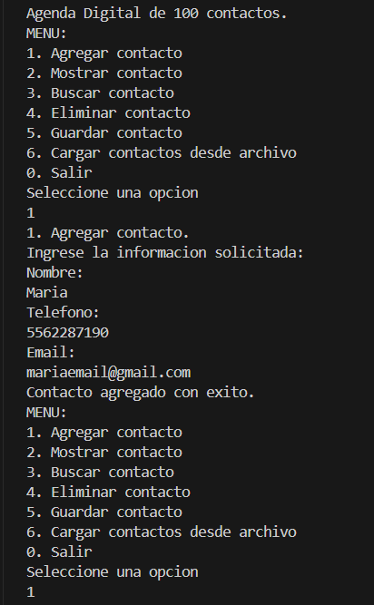
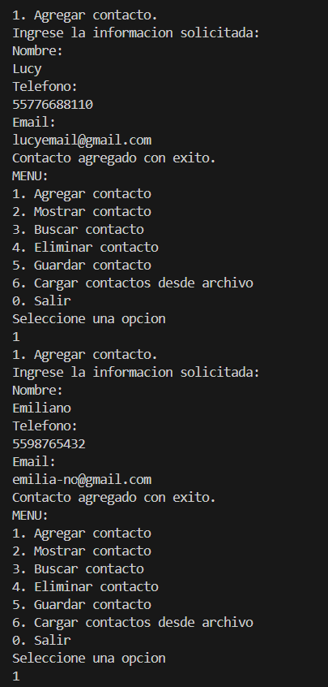
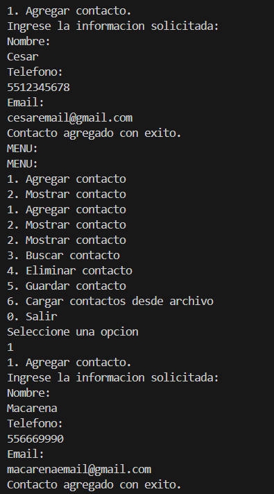
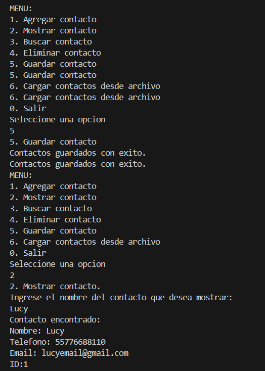
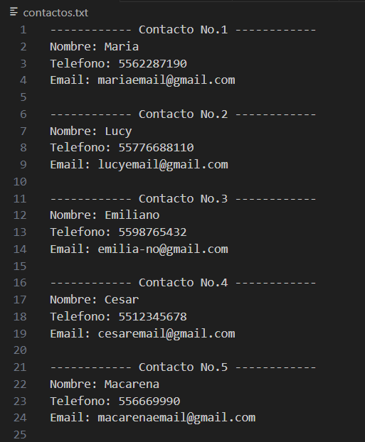
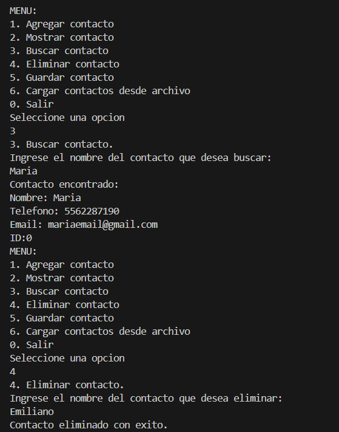
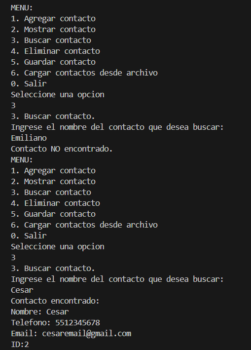
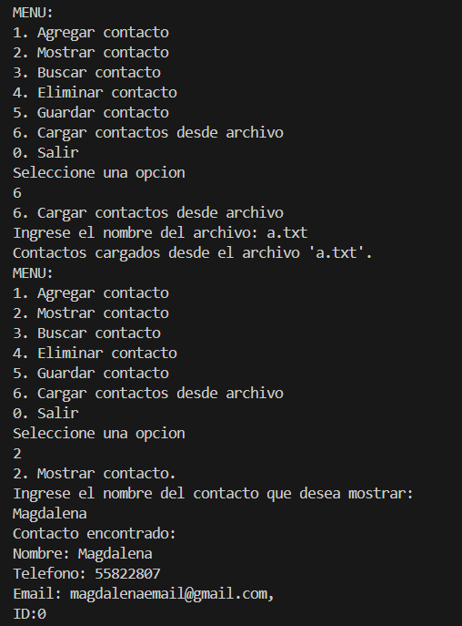
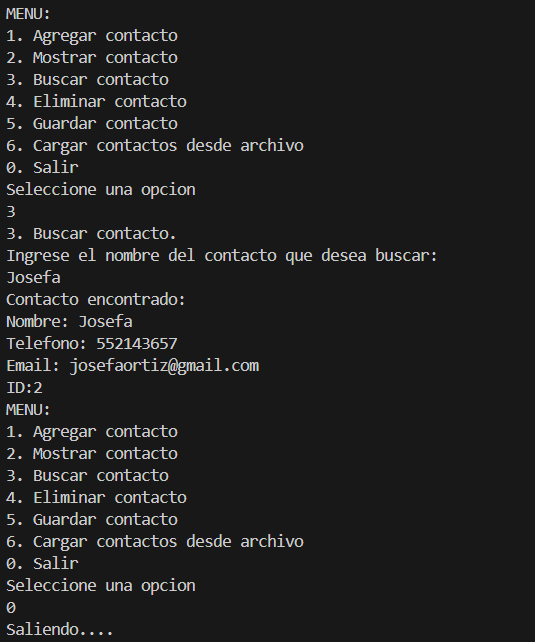
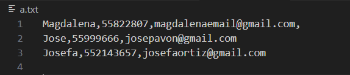

# GestorDeContactos
Practica de Laboratorio: Desarrollo de un gestor de Contactos en C con GitHub y Microsoft Plannner

El objetivo es desarrollar un programa en lenguaje C que funcione como un gestor de contactos. Además, se emplean herramientas colaborativas como GitHub para el control de versiones y Microsoft Planner para la gestión de tareas en equipo.

El gestor de contactos pretende realizar lo sigueinte:
### Funcionalidades
- Agregar nuevos contactos (nombre, teléfono, correo electrónico).
- Mostrar la lista de contactos.
- Buscar un contacto por nombre.
- Eliminar un contacto.
- Guardar los contactos en un archivo de texto.
- Cargar los contactos desde un archivo de texto.

Esta práctica requiere de conocimientos previos

### Instalación y uso
1. Clona este repositorio:
> git clone https://github.com/Nnncyyy/GestorDeContactos.git
2. Compila el programa con un compilador de C:
> gcc gestor_contactos.c -o gestor_contactos
3. Ejecuta el programa:
> ./gestor_contactos

### Colaboración y Control de Versiones
### GitHub
- Se han creado ramas separadas para cada funcionalidad.
- Los cambios se documentan mediante commits descriptivos.
- Se utilizan pull requests para fusionar cambios en la rama principal (main).
- Se emplean issues en GitHub para la asignación de tareas y seguimiento de errores.

- Agregar cambios desde git
> git add .

### Microsoft Planner
- Se creó un tablero de planificación llamado Gestor de Contactos.
- Las tareas fueron organizadas y asignadas entre los miembros del equipo.
- Se establecieron fechas límite para cada funcionalidad del programa.

### Capturas de Pantalla
Caso de uso:

1. Se muestra el menú principal, donde el usuario tiene varias opciones.
2. El usuario selecciona la opción 1 (Agregar contacto).
3. El programa solicita los datos del contacto.
4. El usuario ingresa la información solicitada.
5. El programa confirma que el contacto ha sido agregado con éxito.
6. El menú aparece nuevamente y el usuario sigue agregando otro contacto.
   
 

► Agregando un segundo y tercer contacto. 
  

► Agregando un cuarto y quinto contacto.  
  

8. El usuario guardo un total de 5 contactos. 
9. Se ejecuta la opción 5 (Guardar contactos). 
   

10. Los contactos se guardan en un archivo de texto.  
  

11. El menú se muestra nuevamente y el usuario selecciona la opción 2 (Mostrar contacto).  
  

12. Se ejecuta la opción 3 (Buscar contactos).
13. El menú aparece nuevamente y el usuario selecciona la opción 4 (Eliminar contacto).  
14. Se confirma la eliminación del contacto. 
  

15. Para veficicar la elimicaión del contacto se ejecuta la opción 3 (Buscar contacto).
16. El programa no encontró al contacto, es decir, el contacto fue eliminado exitosamente. 
  

17. El usuario seleciona la opción 6 (Cargar contactos desde un archivo). 
 

 Se muestra que los nombres del archivo que se cargo en el programa posteriorme se guardaron exitosamente y aparecen al usar la opción mostrar : 

 En esta captura solo se corrobora que existe el arichivo cargado (a.txt) del sistema, y por ende los nombres y datos de este: 

### Enlaces Relacionados
- Repositorio en GitHub
  [Github](https://github.com/Nnncyyy/GestorDeContactos)
- Tablero en Microsoft Planner
  [Gestor Plannner - Microsoft](https://planner.cloud.microsoft/webui/plan/f4uoSnfRFEG39JeEiVf0i2QADA3c/view/grid?tid=f94bf4d9-8097-4794-adf6-a5466ca28563)

